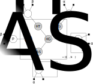

In this R Notebook, we revisit the nuclear power plant model from lectures. 
Recall that the model describes the probability of an alarm sounding conditional on the following variables:

- FA: whether the alarm is faulty
- HT: whether the temperature is high (i.e. reactor is in meltdown)
- FG: whether the temperature gauge is faulty
- HG: whether the temperature gauge reads high

A plate diagram for the model is given below. 
Note that we've explicitly included the probability tables as parameters in the model. 
We're also taking a more Bayesian approach by putting a prior over the entries in the probability tables.




Our goal is to infer the probability tables based on observations (assuming all variables are observed).
We'll use Stan to do the inference.

### Loading observations
Let's begin by loading the observations.
The `nuclear.csv` file contains 10000 observations for all variables (HT, FA, FG, HG, AS) as rows.
We load the file into a dataframe, and cast the binary observations to 0/1 integers.
```{r}
nuclear.df <- read.csv("nuclear.csv", colClasses="logical")
nuclear.df <- nuclear.df * 1L # cast from logical to 0/1
head(nuclear.df)
```

### Model definition
Stan models are specified using the Stan Modelling Language: a custom language with a syntax similar to C.
It's recommended to store models in `.stan` text files.
Our nuclear model is specified in `nuclear.stan`, which we've reproduced below.

```
data {
  int<lower=1> N; // number of observations
  // for each of these, 0 means false, 1 means true
  int<lower=0, upper=1> HT[N];  // whether core temperature high
  int<lower=0, upper=1> FG[N];  // whether gauge is faulty
  int<lower=0, upper=1> FA[N];  // whether alarm is faulty
  int<lower=0, upper=1> HG[N];  // whether gauge reads high
  int<lower=0, upper=1> AS[N];  // whether alarm sounds

  real<lower=0> ALPHA; // alpha to use for beta distributions
  real<lower=0> BETA; // beta to use for beta distributions
}

parameters {
  //probability table for each variable
  real<lower=0, upper=1> p_ht;
  real<lower=0, upper=1> p_fg;  
  real<lower=0, upper=1> p_fa;
  real<lower=0, upper=1> p_hg[2,2];
  real<lower=0, upper=1> p_as[2,2];
}

model {
  // priors for probability table parameters
  p_ht ~ beta(ALPHA, BETA);
  p_fg ~ beta(ALPHA, BETA);
  p_fa ~ beta(ALPHA, BETA);
  for (i in 1:2) {
    for (j in 1:2) {
      p_hg[i, j] ~ beta(ALPHA, BETA); 
      p_as[i, j] ~ beta(ALPHA, BETA);
    }
  }
  
  // likelihood of observing data
  for (n in 1:N) {
    HT[n] ~ bernoulli(p_ht);
    FG[n] ~ bernoulli(p_fg);
    FA[n] ~ bernoulli(p_fa);
    // +1 in indexing below because Stan arrays count from 1
    HG[n] ~ bernoulli(p_hg[HT[n]+1, FG[n]+1]);
    AS[n] ~ bernoulli(p_as[FA[n]+1, HG[n]+1]);
  }
}
```

There are three blocks in this file:

- the *data* block allows us to pass external variables (from R) into Stan. Note that variables are statically typed.
- the *parameters* block defines the sampling space: i.e. the parameters we'd like to infer.
- the *model* block is where we define the posterior distribution.


### Preparing data
When using the R interface for Stan, we must pass the variables in the *data* block as a named list.
The names should match those used in the `.stan` file.
This is easy to do: we simply convert the dataframe to a list, then concatenate it with the `ALPHA`, `BETA` and `N` parameters.
```{r}
data <- c(as.list(nuclear.df), 
          "ALPHA" = 1,
          "BETA" = 1,
          "N" = nrow(nuclear.df))
str(data)
```

### Running Stan
Let's load Stan. 
For installation instructions, follow this [link](https://github.com/stan-dev/rstan/wiki/RStan-Getting-Started).
```{r, results='hide'}
library(rstan)
rstan_options(auto_write = TRUE)
```

To run the inference, we call Stan, passing a reference to our model specification file, in addition to the data from R.
We also specify the number of iterations to run, which is related to the number of posterior samples we'd like.
Note that not all of the iterations yield usable samples: some of them are discarded during a warmup period (before the Markov chain has converged to the posterior).
```{r}
fit <- stan(file='nuclear.stan', data = data, iter = 1000, chains = 2)
```

Calling the `print` function on the output gives us a summary of the posterior distribution for each parameter.
```{r}
print(fit)
```

We can also plot the posterior with Bayesian credible intervals.
```{r}
plot(fit)
```

In practice, we should inspect trace plots to ensure the Markov chains are mixing well.
However this is beyond the scope of COMP90051.
```{r}
traceplot(fit)
```